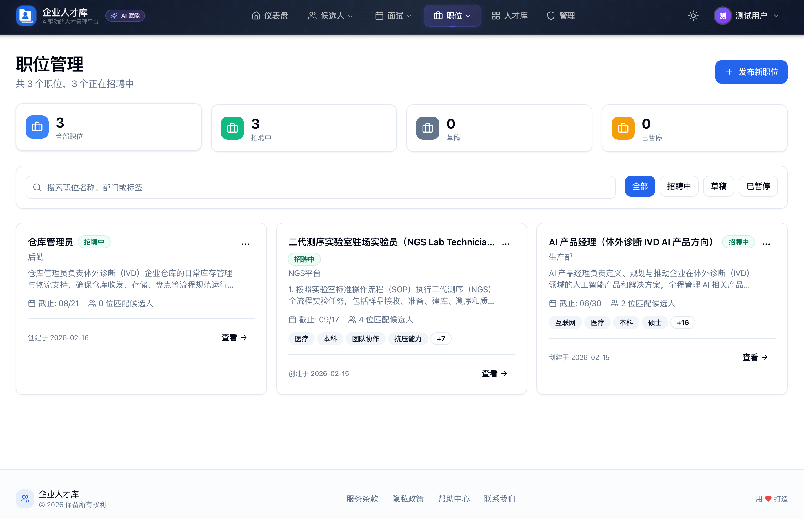
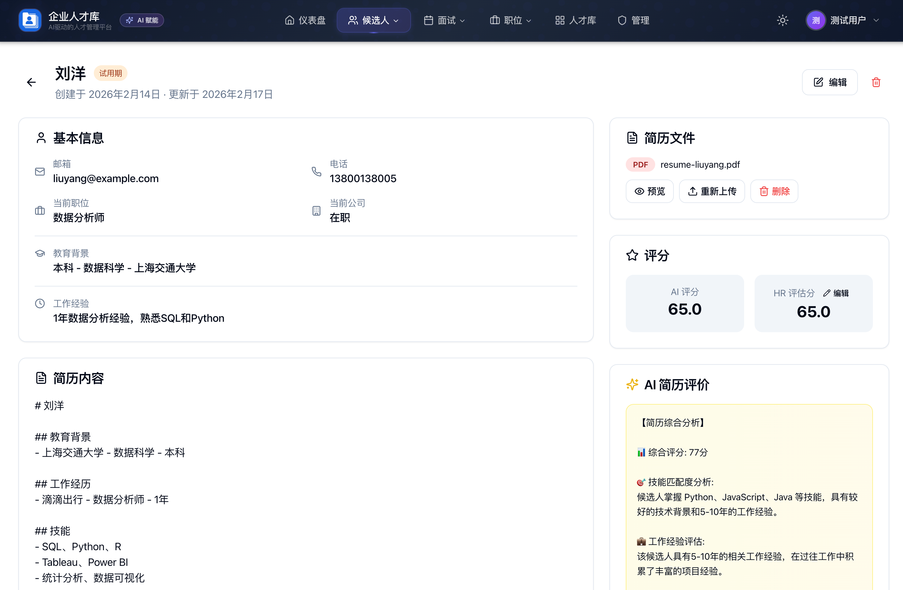
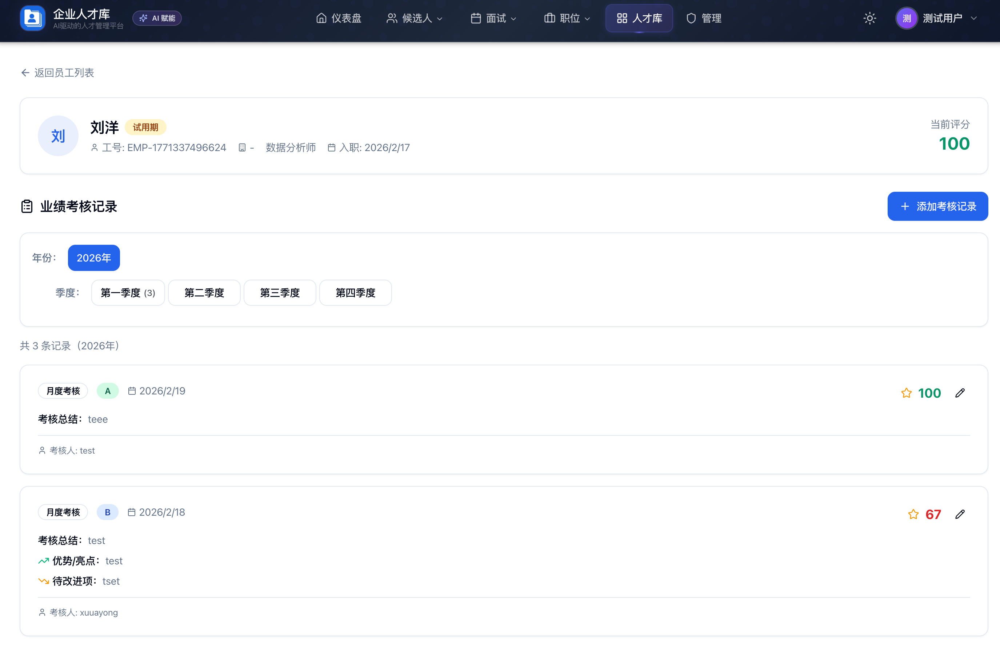

# Inno HeroBase

[English](#english) | [中文](#中文)

---

## English

### Overview

**Inno HeroBase** is an AI-powered HR talent management system designed to streamline the entire recruitment and employee lifecycle management process.

### Features

- **AI Resume Parsing** - Upload PDF resumes, automatically extract and structure candidate information
- **Smart Tagging** - AI-powered skill and industry tag classification
- **Job Posting Management** - Create and manage job postings with AI-assisted descriptions
- **Intelligent Matching** - AI-driven candidate-to-job matching with scoring
- **Interview Management** - Schedule and track interviews with calendar view
- **Employee Lifecycle** - Track probation, performance reviews, rewards and penalties

### Screenshots

| | |
|:---:|:---:|
|  |  |
|  |  |
|  |  |

### Tech Stack

| Category | Technology |
|----------|------------|
| Framework | Next.js 14 (App Router) |
| Database | PostgreSQL + Prisma ORM |
| Authentication | NextAuth.js (JWT) |
| UI | Tailwind CSS + shadcn/ui + Radix UI |
| Storage | MinIO (S3-compatible) |
| AI | LangChain + DeepSeek/Kimi APIs |

### Quick Start

#### Prerequisites

- Node.js 18+
- PostgreSQL 14+
- MinIO (for file storage)

#### Installation

```bash
# Clone the repository
git clone https://github.com/your-org/Inno-herobase.git
cd Inno-herobase

# Install dependencies
npm install

# Configure environment
cp .env.example .env
# Edit .env with your database and MinIO credentials

# Initialize database
npx prisma migrate deploy
npm run seed

# Start development server
npm run dev
```

Visit `http://localhost:4005`

Default admin: `xuhuayong@Inno.com` / `123456A`

### Docker Deployment

```bash
# Configure
cp docker/.env.docker.example docker/.env.docker
vim docker/.env.docker

# Deploy
./docker/deploy.sh deploy

# Verify
./docker/deploy.sh ps
./docker/deploy.sh logs
```

See [docker/README.md](docker/README.md) for more options.

### Project Structure

```
src/
├── app/
│   ├── api/          # API routes
│   ├── candidates/   # Candidate management pages
│   ├── employees/    # Employee management pages
│   ├── interviews/   # Interview scheduling pages
│   ├── job-postings/ # Job posting pages
│   └── components/   # Shared React components
├── lib/              # Utilities and hooks
prisma/
├── schema.prisma     # Database schema
└── migrations/       # Database migrations
```

### Community

Scan the QR code below to join our discussion group:


### License

MIT License

---

## 中文

### 项目简介

**Inno HeroBase（公司人才库）** 是一个 AI 驱动的人力资源管理系统，旨在优化从招聘到员工全生命周期的管理流程。

### 核心功能

- **AI 简历解析** - 上传 PDF 简历，自动提取并结构化候选人信息
- **智能标签** - AI 驱动的技能和行业标签分类
- **职位管理** - 创建和管理职位，支持 AI 辅助生成职位描述
- **智能匹配** - AI 驱动的候选人-职位匹配评分
- **面试管理** - 日历视图的面试安排和跟踪
- **员工生命周期** - 试用期、绩效考核、奖惩记录管理

### 系统截图

| | |
|:---:|:---:|
|  |  |
|  |  |
|  |  |

### 技术栈

| 类别 | 技术 |
|------|------|
| 框架 | Next.js 14 (App Router) |
| 数据库 | PostgreSQL + Prisma ORM |
| 认证 | NextAuth.js (JWT) |
| UI | Tailwind CSS + shadcn/ui + Radix UI |
| 存储 | MinIO (S3 兼容) |
| AI | LangChain + DeepSeek/Kimi APIs |

### 快速开始

#### 环境要求

- Node.js 18+
- PostgreSQL 14+
- MinIO（文件存储）

#### 安装步骤

```bash
# 克隆仓库
git clone https://github.com/your-org/Inno-herobase.git
cd Inno-herobase

# 安装依赖
npm install

# 配置环境变量
cp .env.example .env
# 编辑 .env，填入数据库和 MinIO 配置

# 初始化数据库
npx prisma migrate deploy
npm run seed

# 启动开发服务器
npm run dev
```

访问 `http://localhost:4005`

默认管理员：`xuhuayong@Inno.com` / `123456A`

### Docker 部署

```bash
# 配置环境变量
cp docker/.env.docker.example docker/.env.docker
vim docker/.env.docker

# 一键部署
./docker/deploy.sh deploy

# 验证服务
./docker/deploy.sh ps
./docker/deploy.sh logs
```

更多选项参见 [docker/README.md](docker/README.md)。

### 项目结构

```
src/
├── app/
│   ├── api/          # API 路由
│   ├── candidates/   # 候选人管理页面
│   ├── employees/    # 员工管理页面
│   ├── interviews/   # 面试安排页面
│   ├── job-postings/ # 职位发布页面
│   └── components/   # 共享 React 组件
├── lib/              # 工具函数和 hooks
prisma/
├── schema.prisma     # 数据库模型
└── migrations/       # 数据库迁移
```

### 交流群

讨论AI技术在HR行业的应用，扫描下方二维码加入讨论群：


### 开源协议

MIT License
